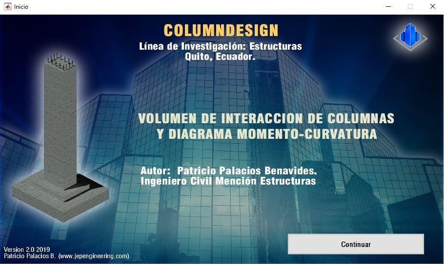

# ColumnDesignV2.0
## RCC DESIGN BY INTERACTION SURFACE AND MOMENT CURVATURE DIAGRAM. GRAPHIC INTERFACE IN MATLAB

### [Patricio Palacios](https://github.com/ppalacios92) 

Abstract. This investigation is based on different models to obtain a moment-curvature diagram of various Reinforced Concrete Columns (RCC). The research aims to identify a model that allows obtaining adequate results regarding the structural performance of these RCC sections. Ductility variation is analyzed, which can be presented by adding nonlinear materials, considering biaxial behavior, and accounting for axial load effects. To achieve this ductility variation, two different conditions were developed, which consider deformation limits and damage controls for the materials. The first condition addresses non-structural safety affectation, while the second condition pertains to the severe damage state of structural elements. These performance conditions were evaluated for several discretization approaches of the cross-section and the utilization of some constitutive materials existing in the bibliography, including the ACI 318S proposal and the Mander et al. (1988) concrete confined model. These idealizations were compared with each other to determine RCC design using a graphic interface, considering different ductility magnitudes and their variations when axial load and biaxial bending behavior are taken into account.

### Disclaimer

The information and findings presented in this work are provided for educational and informational purposes only. The author makes no representations or warranties of any kind, expressed or implied, about the completeness, accuracy, reliability, suitability, or availability of the information. Any reliance you place on such information is strictly at your own risk. The author disclaims any responsibility for the accuracy, content, or availability of information found on this site or sites that are linked to or from this work. The author shall not be liable for any errors or omissions in this information or for the availability of this information. The author shall not be liable for any losses, injuries, or damages from the display or use of this information.

The content provided in this work is not intended to replace professional advice or guidance. It is important to seek the services of a professional for such matters. The author reserves the right to make additions, deletions, or modification to the contents of this work at any time without prior notice.

By reading this work, you acknowledge and agree to the terms of this disclaimer. If you do not agree with these terms, kindly refrain from using or accessing this information.

